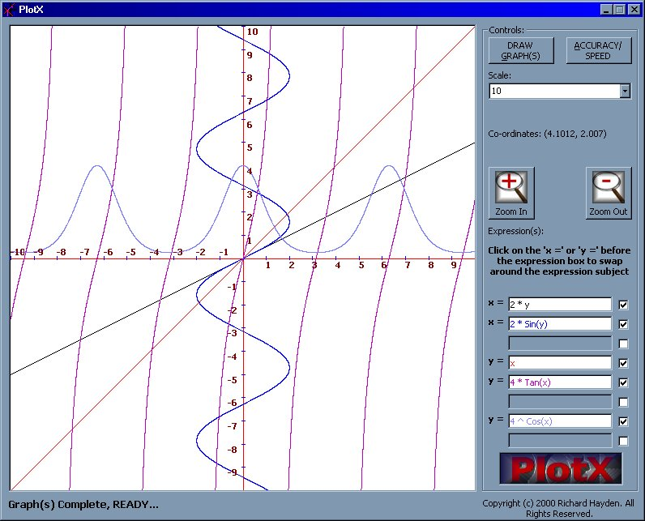



## PlotX: Graphics Plotter \(y = 2 ^ Sin\(x\) etc\.\) \(\*\*UPDATE: VERSION: 1\.3\.0\*\*\*\)

### Description

PlotX allows the user to plot up to eight graphs (of the y = ax2 + bx + c type or NOW the x = ay2 + by + c type!) at a time. The user can also use many built in functions like

Sin() and Tan() or Sqr() etc. in their expressions. Expressions are inputted using textboxes and evaluated with the Microsoft Script Control. Colour coding is used and multiple accuracy/speed settings are implemented for ease of use. The scale can also be changed and you can zoom in or out on the graphing area. Version 1.3.0 (THIS ONE) now supports both expressions beginning in 'y =' AND 'x ='! Another addition in version 1.3.0 are two new ULTRA high accuracy settings for very high accuracy graphing.
 
### More Info
 

             |
---                |---
**Submitted On**   |2000-11-11 10:42:28
**By**             |[Rich Hayden](https://github.com/Planet-Source-Code/PSCIndex/blob/master/ByAuthor/rich-hayden.md)
**Level**          |Intermediate
**User Rating**    |4.4 (31 globes from 7 users)
**Compatibility**  |VB 6\.0
**Category**       |[Math/ Dates](https://github.com/Planet-Source-Code/PSCIndex/blob/master/ByCategory/math-dates__1-37.md)
**World**          |[Visual Basic](https://github.com/Planet-Source-Code/PSCIndex/blob/master/ByWorld/visual-basic.md)
**Archive File**   |[CODE\_UPLOAD1157911112000\.zip](https://github.com/Planet-Source-Code/rich-hayden-plotx-graphics-plotter-y-2-sin-x-etc-update-version-1-3-0__1-12667/archive/master.zip)

### API Declarations

See Code.

